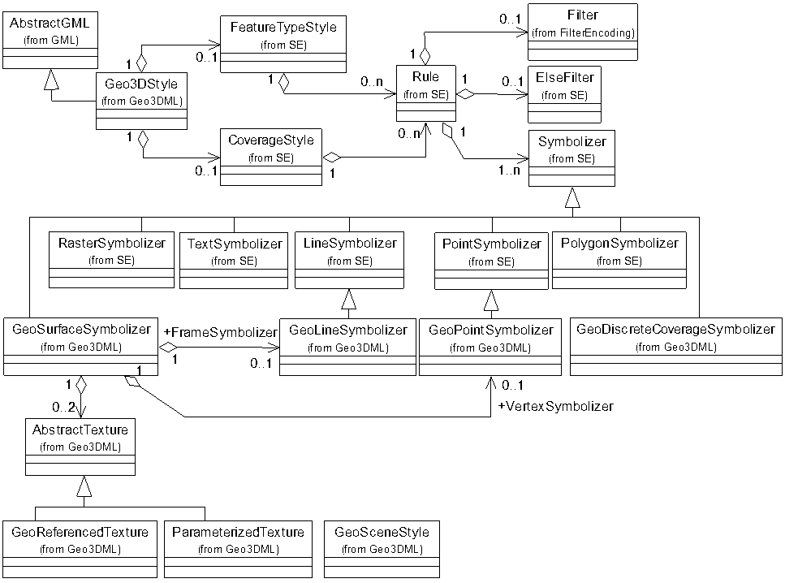
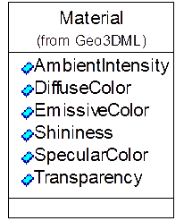
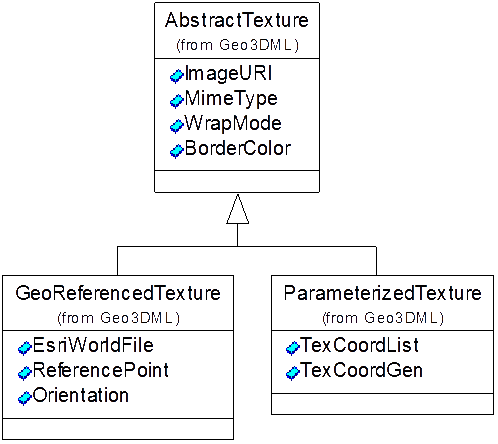
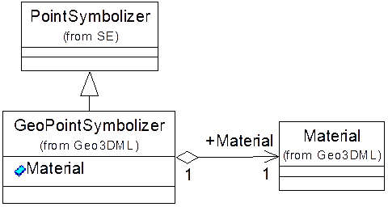
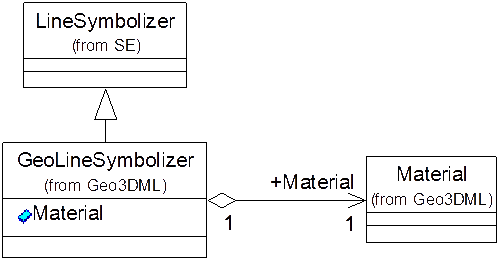
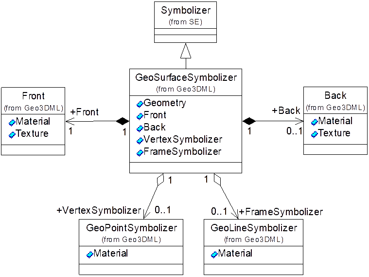
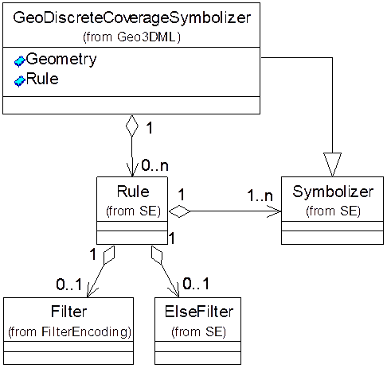
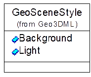
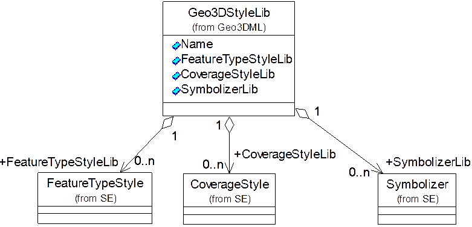

# 10 可视化参数模块

## 10.1 概述

Geo3DML以SE规范为核心，参考SLD、CityGML、X3D等规范定义了3D可视化参数编码规则。[图21](#pic-21)描述了可视化参数模块的框架结构。

<a name="pic-21" /><caption>图21 可视化参数的框架结构</caption>

Geo3DML参考SLD规范的`sld:UserStyle`结构定义了`geo3dml:Geo3DStyle`作为可视化参数数据结构。`geo3dml:Geo3DStyle`对象可以方便地转换为`sld:UserStyle`结构。`geo3dml:Geo3DStyle`结构中的核心内容来自SE规范，包括`se:FeatureTypeStyle`、`se:CoverageStyle`、`se:Rule`、`se:Symboizer`，以及`se:ElseFilter`等，而`ogc:Filter`则来自OGC的Filter Encoding规范。其中，`se:FeatureTypeStyle`用于定义普通要素的可视化参数，而`se:CoverageStyle`用于定义空间覆盖数据的可视化参数。`ogc:Filter`与`se:ElseFilter`用于设置基于要素属性的可视化参数匹配条件。而`se:Symbolizer`及其子类型定义了针对不同类型几何对象的可视化参数格式。此外，`geo3dml:GeoSceneStyle`是针对场景的全局可视化参数，如场景的背景颜色、全局光照等。

<a name="tbl-21" /><caption>表21 geo3dml:Geo3DStyle子元素列表（省略名字空间）</caption>

|序号|子集/实体名|元素名|定义|出现次数|类型|值域|
|---|---|---|---|---|---|---|
|16|Geo3DStyle|Geo3DStyle|3D可视化参数根元素。||类||
|16.1||se:FeatureTypeStyle|普通要素数据可视化参数。|0..1|类|引用se:FeatureTypeStyle实例。|
|16.2||se:CoverageStyle|覆盖要素数据的可视化参数。|0..1|类|引用se:CoverageStyle实例。|

[表21](#tbl-21)中，子元素`se:FeatureTypeStyle`与子元素`se:CoverageStyle`是二选一的互斥关系，即元素`Geo3DStyle`中要么包含子元素`se:FeatureTypeStyle`，要么包含子元素`se:CoverageStyle`。

为支持3D可视化，Geo3DML对SE规范进行扩展，定义了点（`geo3dml:GeoPointSymbolizer`）、线（`geo3dml:GeoLineSymbolizer`）和曲面（`geo3dml:GeoSurfaceSymbolizer`）的可视化参数结构。扩展的内容主要是在SE规范相应结构的基础上增加3D可视化的光照、材质与纹理参数。针对属性场数据（见“9 属性场数据模块”）定义了专门的可视化参数结构：`geo3dml:GeoDiscreteCoverageSymbolizer`。

设置地质要素的可视化参数（包括材质颜色与填充符号）时，可依据GB/T 958-1989、GB/T 6390-1986、DZ/T 0179-1997等标准执行。

## 10.2 材质

材质参数(`geo3dml:Material`)的结构见[图22](#pic-22)及[表22](#tbl-22)。

<a name="pic-22" /><caption>图22 geo3dml:Material的结构</caption>

<a name="tbl-22" /><caption>表22 geo3dml:Material子元素列表（省略名字空间）</caption>

|序号|子集/实体名|元素名|定义|出现次数|类型|值域|
|---|---|---|---|---|---|---|
|17|Material|Material|3D可视化材质。||类||
|17.1||AmbientIntensity|环境光强度。指漫反射光的最小强度。|0..1|浮点数|[0,1]。默认值为0.2。|
|17.2||DiffuseColor|漫反射光的颜色。如果不考虑光照，则漫反射光就是对象的颜色。|0..1|类|geo3dml:Color实例（见“12 基础数据结构模块”）。默认值为(0.8,0.8,0.8)。|
|17.3||EmissiveColor|辐射光的颜色，即对象自身发光的颜色。|0..1|类|geo3dml:Color实例。默认值为(0.0,0.0,0.0)。|
|17.4||Shininess|聚光度。|0..1|浮点数|[0,1]。默认值为0.2。|
|17.5||SpecularColor|镜面反射光的颜色。|0..1|类|geo3dml:Color实例。默认值为(1.0,1.0,1.0)。|
|17.6||Transparency|透明度：0表示完全不透明；1表示完全透明。|0..1|浮点数|[0,1]。默认值为0.0。|

## 10.3 纹理

纹理参数包括三种类型：`geo3dml:AbstractTexture`、`geo3dml:GeoReferenceTexture`，以及`geo3dml:ParameterizedTexture`。纹理参数的结构见[图23](#pic-23)。

<a id="pic-23" /><caption>图23 纹理参数结构示意图</caption>

`geo3dml:AbstractTexture`是纹理参数的抽象基类型，其定义的内容包括纹理图片的来源（ImageURI）、图片的类型（MimeType），以及贴图模式（WrapMode）。其中，贴图模式可为如下几种方式之一：单幅填充（None，默认值）、重复（Wrap）、镜像（Mirror）、按纹理图片的边界扩展（Clamp），或按定义的边界颜色扩展（Border）。当选择Border模式时，需设置此模式下所使用的边界颜色（BorderColor）。

`geo3dml:GeoReferencedTexture`允许使用地理坐标参数作为纹理坐标映射的参数。其子元素`ReferencePoint`记录坐标映射原点，子元素`Orientation`记录纹理坐标的变换矩阵。

`geo3dml:ParameterizedTexture`允许显示地指定空间数据顶点的纹理坐标或其纹理坐标计算参数。其`TexCoordList`成员用于按序列出各顶点的纹理坐标，或者也可利用`TexCoordGen`成员保存的矩阵参数计算各顶点的纹理坐标。

<a id="tbl-23" /><caption>表23 geo3dml:AbstractTexture子元素列表（省略名字空间）</caption>

|序号|子集/实体名|元素名|定义|出现次数|类型|值域|
|---|---|---|---|---|---|---|
|18|AbstractTexture|AbstractTexture|纹理参数。||类||
|18.1||ImageURI|纹理图片的路径。|1|字符串|文件路径。|
|18.2||MimeType|纹理图片的类型。|1|字符串|纹理文件的后缀。|
|18.3||WrapMode|纹理的贴图模式。|1|字符串|枚举值：None（单幅填充）；Wrap（重复）；Mirror（镜像）；Clamp（按纹理图片的边界扩展）；Border（按定义的边界颜色扩展）。默认值为：None。|
|18.4||BorderColor|按边界颜色填充纹理时所使用的边界颜色：RGBA。|0..1|类|geo3dml:ColorPlusAlpha实例（见“12 基础数据结构模块”）。|

<a id="tbl-24" /><caption>表24 geo3dml:GeoReferencedTexture子元素列表（省略名字空间）</caption>

|序号|子集/实体名|元素名|定义|出现次数|类型|值域|
|---|---|---|---|---|---|---|
|19|GeoReferencedTexture|GeoReferencedTexture|纹理参数。||类||
|19.1||ReferencePoint|坐标映射原点。|0..1|类|引用gml:Point实例。|
|19.2||Orientation|坐标变换矩阵。|0..1|类|引用geo3dml:TransformationMatrix2x2实例（见“12 基础数据结构模块”）。|

<a id="tbl-25" /><caption>表25 geo3dml:ParameterizedTexture子元素列表（省略名字空间）</caption>

|序号|子集/实体名|元素名|定义|出现次数|类型|值域|
|---|---|---|---|---|---|---|
|20|ParameterizedTexture|ParameterizedTexture|纹理参数。||类||
|20.1||TexCoordList|纹理坐标数组：依序列出顶点所对应的纹理坐标。|0..1|类|gml:DirectPositionList实例。|
|20.2||TexCoordGen|纹理坐标计算矩阵。|0..1|类|geo3dml:TransformationMatrix3x4实例（见“12 基础数据结构模块”）。|

[表25](#tbl-25)中，子元素20.1部分的内容与20.2部分的内容是二选一的互斥关系，即元素`ParameterizedTexture`要么包含子元素`TexCoordList`，要么包含子元素`TexCoordGen`。

## 10.4 点参数

点类型对象的3D可视化参数结构（`geo3dml:GeoPointSymbolizer`）继承自`se:PointSymbolizer`，并且允许设置材质参数（见“10.2 材质”），其结构见[图24](#pic-24)及[表26](#tbl-26)。

<a id="pic-24" /><caption>图24 geo3dml:GeoPointSymbolizer的结构</caption>

<a id="tbl-26" /><caption>表26 geo3dml:GeoPointSymbolizer子元素列表（省略名字空间）</caption>

|序号|子集/实体名|元素名|定义|出现次数|类型|值域|
|---|---|---|---|---|---|---|
|21|GeoPointSymbolizer|GeoPointSymbolizer|点的可视化参数。||类||
|21.1||Material|材质参数。|0..1|类|Material实例（见“10.2 材质”）。|

## 10.5 线参数

线类型对象的3D可视化参数结构（`geo3dml:GeoLineSymbolizer`）继承自`se:LineSymbolizer`，并且允许设置材质参数（见“10.2 材质”），其结构见[图25](#pic-25)及[表27](#tbl-27)。

<a id="pic-25" /><caption>图25 geo3dml:GeoLineSymbolizer的结构</caption>

<a id="tbl-27" /><caption>表27 geo3dml:GeoLineSymbolizer子元素列表（省略名字空间）</caption>

|序号|子集/实体名|元素名|定义|出现次数|类型|值域|
|---|---|---|---|---|---|---|
|22|GeoLineSymbolizer|GeoLineSymbolizer|线的可视化参数。||类||
|22.1||Material|材质参数。|0..1|类|Material实例（见“10.2 材质”）。|

## 10.6 面参数

面类型对象的3D可视化参数结构（`geo3dml:GeoSurfaceSymbolizer`）继承自`se:Symbolizer`，允许分别指定曲面正面、背面的光照、材质与纹理参数。此外，如果曲面是由顶点-面片组合而成，则还可指定顶点与线框的可视化参数，即`VertexSymbolizer`与`FrameSymbolizer`。该参数的结构见[图26](#pic-26)及[表28](#tbl-28)。

<a id="pic-27" /><caption>图27 geo3dml:GeoSurfaceSymbolizer的结构</caption>

其中，`Front`表示正面的可视化参数，包括材质（`Front:Material`）和纹理参数（`Front:Texture`）。`Back`表示背面的可视化参数，包括材质（`Back:Material`）和纹理参数（`Back::Texture`）。其中正面参数是必填的，而背面参数是可选的。

顶点的可视化参数（`VertexSymbolizer`）是可选的，其定义参见“10.4 点参数”。

线框的可视化参数（`FrameSymbolizer`）是可选的，其定义参见“10.5 线参数”。

<a id="tbl-28" /><caption>表28 geo3dml:GeoSurfaceSymbolizer子元素列表（省略名字空间）</caption>

|序号|子集/实体名|元素名|定义|出现次数|类型|值域|
|---|---|---|---|---|---|---|
|23|GeoSurfaceSymbolizer|GeoSurfaceSymbolizer|面的可视化参数。||类||
|23.1||se:Geometry|指定要被绘制的几何属性域的名字（要素对象可能存在多个几何属性域）。|0..1|类|se:Geometry实例，即以字符串形式记录的属性字段的名字。|
|23.2|Front|Front|正面的可视化属性：颜色或纹理。|1|||
|23.2.1||Material|正面的颜色参数。|0..1|类|引用Material实例（见“10.2 材质”）。|
|23.2.2||AbstractTexture|正面的纹理参数。|0..1|类|引用AbstractTexture实例（见“10.3 纹理”）。|
|23.3|Back|Back|背面的可视化属性（可选）：颜色或纹理。|0..1|||
|23.3.1||Material|背面的颜色参数。|0..1|类|引用Material实例（见“10.2 材质”）。|
|23.3.2||AbstractTexture|背面的纹理参数。|0..1|类|引用AbstractTexture实例（见“10.3 纹理”）。|
|23.4||VertexSymbolizer|顶点的可视化参数（可选）。|0..1|类|引用GeoPointSymbolizer实例（见“10.4 点参数”）。|
|23.5||FrameSymbolizer|线框的可视化参数（可选）。|0..1|类|引用GeoLineSymbolizer实例（见“10.5 线参数”）。|

[表28](#tbl-28)中，23.2.1部分的内容与23.2.2部分的内容是二选一的互斥关系，即元素`Front`要么包含23.2.1部分的内容，要么包括23.2.2部分的内容。23.3.1部分的内容与23.3.2部分的内容是二选一的互斥关系，即元素`Back`要么包含23.3.1部分的内容，要么包括22.3.2部分的内容。

## 10.7 属性场数据参数 

属性场数据（`geo3dml:GeoDiscreteCoverage`）的3D可视化参数结构（`geo3dml:GeoDiscreteCoverageSymbolizer`）继承自`se:Symbolizer`，支持根据属性条件匹配场中的几何对象从而设置可视化参数。该参数的结构见[图27](#pic-27)及[表29](#tbl-29)。

<a id="pic-27" /><caption>图27 geo3dml:GeoDiscreteCoverageSymbolizer的结构</caption>

<a id="tbl-29" /><caption>表29 geo3dml:GeoDiscreteCoverageSymbolizer子元素列表（省略名字空间）</caption>

|序号|子集/实体名|元素名|定义|出现次数|类型|值域|
|---|---|---|---|---|---|---|
|24|GeoDiscreteCoverageSymbolizer|GeoDiscreteCoverageSymbolizer|属性场的可视化参数。||类||
|24.1||Geometry|指定要被绘制的属性场的名字（要素对象可能存在多个属性域场）。|0..1|类|se:Geometry实例，即以字符串形式记录的属性场的名字。|
|24.2||Rule|属性场中几何对象的匹配条件。|0..n|类|se:Rule实例。|

`geo3dml:GeoDiscreteCoverageSymbolizer`的结构类似于`se:FeatureTypeStyle`。指定属性场的可视化参数时，应先通过`se:FeatureTypeStyle`选择对应的地质要素（`geo3dml:GeoFeature`），然后通过`geo3dml:GeoDiscreteCoverageSymbolizer`的`geo3dml:Geometry`元素选择要被绘制的属性场对象（`geo3dml:GeoDiscreteCoverage`），之后运用`geo3dml:GeoDiscreteCoverageSymbolizer`的`se:Rule`元素具体描述场中具有不同属性的几何对象的可视化参数。

## 10.8 体数据参数

描述体对象的方法有两种：一种是利用封闭的曲面描述体的表面；一种是将体的内部空间划分为体元，通过这些体元来表达体。采用前一种方式时，体的3D可视化参数应采用面参数（见“10.6 面参数”）；采用后一种方式时，体可被理解为属性场，因而体的3D可视化参数应采用属性场数据参数（见“10.7 属性场数据参数”）。

## 10.9 场景参数

场景参数（`geo3dml:GeoSceneStyle`）用于描述全局参数，包括场景的背景颜色和全局光照参数。该参数的结构见[图28](#pic-28)和[表30](#tbl-30)。

<a id="pic-28" /><caption>图28 geo3dml:GeoSceneStyle的结构</caption>

<a id="tbl-30" /><caption>表30 geo3dml:GeoSceneStyle子元素列表（省略名字空间）</caption>

|序号|子集/实体名|元素名|定义|出现次数|类型|值域|
|---|---|---|---|---|---|---|
|25|GeoSceneStyle|GeoSceneStyle|可视化场景参数。||类||
|25.1||Background|背景颜色。|0..1|类|geo3dml:Color实例（见“12 基础数据结构模块”）。默认值为（0,0,0）。|
|25.2||Light|全局光照参数。|0..8|||
|25.2.1||On|标记该光源的启用状态。|0..1|布尔值|值为true时表示启用该光源，否则表示不使用该光源。默认值为true。|
|25.2.2||Type|光源的类型。|0..1|字符串|枚举值：Head（头灯），Camera（相机灯），Scene（场景灯）。默认值为：Scene。|
|25.2.3||Position|光源的位置。|0..1|类|长度为3的gml:doubleList实例。默认值为：（0.0 0.0 1.0）。|
|25.2.4||FocalPosition|灯光的聚焦位置。与光源的位置配合起来可计算光照的方向。|0..1|类|长度为3的gml:doubleList实例。默认值为（0.0 0.0 0.0）。|
|25.2.5||Intensity|光源的强度。|0..1|类|geo3dml:DoubleBetween0And1（见“12 基础数据结构模块”）实例。默认值为1.0。|
|25.2.6||AmbientColor|光源的环境光颜色。|0..1|类|geo3dml:Color（见“12 基础数据结构模块”）实例。默认值为：（1.0,1.0,1.0）。|
|25.2.7||DiffuseColor|光源的漫反射光颜色。|0..1|类|geo3dml:Color（见“12 基础数据结构模块”）实例。默认值为：（1.0,1.0,1.0）。|
|25.2.8||SpecularColor|光源的镜面光颜色。|0..1|类|geo3dml:Color（见“12 基础数据结构模块”）实例。默认值为：（1.0,1.0,1.0）。|

## 10.10 可视化参数库

`geo3dml:Geo3DStyle`元素可以直接引用预定义的可视化参数。Geo3DML定义了地质要素可视化参数库（`ge3dml:Geo3DStyleLib`）以集中存储各类预定义参数。其结构见[图29](#pic-29)及[表31](#tbl-31)。

<a id="pic-29" /><caption>图29 geo3dml:Geo3DStyleLib的结构</caption>

<a id="tbl-31" /><caption>表31 geo3dml:Geo3DStyleLib子元素列表（省略名字空间）</caption>

|序号|子集/实体名|元素名|定义|出现次数|类型|值域|
|---|---|---|---|---|---|---|
|26|Geo3DStyleLib|Geo3DStyleLib|可视化参数库。||类||
|26.1||Name|库的名字。|1|字符串|自由文本。|
|26.2|FeatureTypeStyleLib|FeatureTypeStyleLib|库中包含的se:FeatureTypeStyle实例的集合。|0..1|类||
|26.2.1||se:FeatureTypeStyle|库中包含的se:FeatureTypeStyle实例。|0..N|类|se:FeatureTypeStyle实例。|
|26.3|CoverageStyleLib|CoverageStyleLib|库中包含的se:CoverageStyle实例的集合。|0..1|类||
|26.3.1||se:CoverageStyle|库中包含的se:CoverageStyle实例。|0..N|类|se:CoverageStyle实例。|
|26.4|SymbolizerLib|SymbolizerLib|库中包含的se:Symbolizer实例的集合。|0..1|类||
|26.4.1||se:Symbolizer|库中包含的se:Symbolizer实例。|0..N|类|se:Symbolizer实例。|

`geo3dml:GeoStyleLib`中`FeatureTypeStyleLi`成员用于记录预定义的`se:FeatureTypeStyle`参数，`CoverageStyleLib`成员用于记录与定义的`se:CoverageStyle`参数，而`SymbolizerLib`成员则用于记录预定义的`se:Symbolizer`结构。
