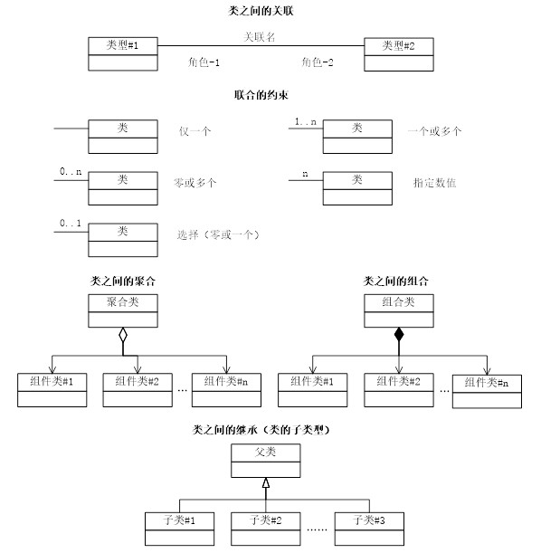
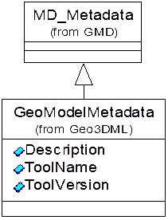

# 4 缩略语和符号

## 4.1 缩略语

| | |
|---|---|
|3D|三维（Three-Dimensional）|
|CityGML|OGC城市地理标记语言（OGC: City Geography Markup Language）|
|Geo3DML|三维地质模型标记语言（Three-Dimensional Geological Model Markup Language）|
|GMD|地理信息 元数据（Geographic Information——Metadata）|
|GML|地理标记语言（Geography Markup Language）|
|OGC|开放地理信息联盟（Open Geospatial Consortium）|
|SE|OGC符号编码规范（Symbology Encoding）|
|SLD|OGC样式化三维图层描述符（OGC: Styled Layer Descriptor）|
|SWE|OGC传感器万维网增强协议（OGC: Sensor Web Enablement）|
|TIN|不规则三角网（Triangulated Irregular Network）|
|UML|统一建模语言（Unified Modeling Language）|
|XML|可扩展标记语言（Extensible Markup Language）|
|XSD|XML模式定义语言（XML Schema Definition Language）|

## 4.2 UML符号

（1）UML标记

本标准的说明图件采用UML静态结构图表示，其标记见[图1](#pic-1)。

<caption><a name="pic-1">图1 UML标记</a></caption>

（2）UML对象的构造型说明

UML对象的构造型表达对其自身的扩展。本标准主要使用了以下构造型：

`<<Geometry>>`表示该对象是一个几何对象，继承自GML抽象类型`gml:AbstractGeometryType`；

`<<GeologicFeatureType>>`表示该对象是一个具有地质语义信息的地质要素，继承自GML抽象类型`gml:AbstractFeatureType`；

`<<GeologicType>>`表示该对象是一种地质数据类型，继承自GML抽象类型`gml:AbstractGMLType`；

`<<CodeList>>`是枚举值，它使用字符串表示一系列可能的值。

（3）UML对象的表达方式

为了区分本标准定义的类型和引用自相关规范的类型，标注了类型的来源。

<caption><a name="pic-2">图2 UML类图实例</a></caption>

以[图2](#pic-2)为例，`MD_Metadata`来自现行的GB/Z 24357-2009标准，其标准名简记为GMD，因此以“from GMD”标识；`GeoModelMetadata`是本标准定义的元数据类型，以“from Geo3DML”标识。

## 4.3 XML名字空间

本标准采用XSD定义三维地质模型数据的XML交换格式，使用的名字空间为“geo3dml”。本标准所引用的其它标准的XSD的名字空间见[表1](#tbl-1)。

<caption><a name="tbl-1">表1 本标准所引用标准的名字空间</a></caption>

|规范名|XSD链接地址|名字空间|
|---|---|---|
|Filter Encoding v1.1.0|[http://schemas.opengis.net/filter/1.1.0/filter.xsd](http://schemas.opengis.net/filter/1.1.0/filter.xsd)|ogc|
|Geographic Information——Metadata|[http://www.isotc211.org/2005/gmd/metadataEntity.xsd](http://www.isotc211.org/2005/gmd/metadataEntity.xsd)|gmd|
|GML 3.2.1|[http://schemas.opengis.net/gml/3.2.1/gml.xsd](http://schemas.opengis.net/gml/3.2.1/gml.xsd)|gml|
|GML 3.2.1 Application Schema for Coverages|[http://schemas.opengis.net/gmlcov/1.0/gmlcovAll.xsd](http://schemas.opengis.net/gmlcov/1.0/gmlcovAll.xsd)|gmlcov|
|Sensor Web Enablement|[http://schemas.opengis.net/sweCommon/2.0/swe.xsd](http://schemas.opengis.net/sweCommon/2.0/swe.xsd)|swe|
|Symbology Encoding|[http://schemas.opengis.net/se/1.1.0/FeatureStyle.xsd](http://schemas.opengis.net/se/1.1.0/FeatureStyle.xsd)|se|
