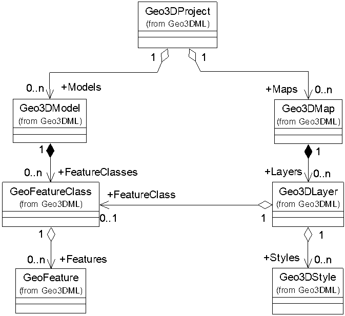

# 5 Geo3DML构成

Geo3DML将被交换的三维地质模型数据划分为两部分（见[图3](#pic-3)）：描述地质现象及现象之间关系的数据和地质模型的三维可视化数据。三维地质模型（`Geo3DModel`）、地质要素类（`GeoFeatureClass`）以及地质要素（`GeoFeature`）用来描述地质现象以及现象之间的关系；三维地质图（`Geo3DMap`）、三维地质图层（`Geo3DLayer`）以及三维地质样式（`Geo3DStyle`）用来记录三维地质模型对应的可视化数据。上述两部分数据组合起来构成被交换数据的整体，称为“三维数据包”（`Geo3DProejct`）。在记录被交换数据的XML文件中，`geo3dml:Geo3DProject`是根元素，`geo3dml`是其名字空间。

<caption><a name="pic3">图3 Geo3DML数据组织层次结构</a></caption>

Geo3DML利用XSD语言定义了上述框架，主要包括如下7个模块（见图4和表2）：

<caption><a name="pic4">图4 Geo3DML模块构成</a></caption>

<caption><a name="tbl2">表2 Geo3DML模块说明</a></caption>

|序号|模块名称|名字空间|XSD文件|说明|
|---|---|---|---|---|
|1|三维数据包 （Geo3DProject）|geo3dml|Geo3DML.xsd GeoModel.xsd Geo3DMap.xsd|定义地质模型数据及其三维可视化场景的结构，是Geo3DML所定义的数据交换格式的主体部分。|
|2|地质要素 (GeoFeature)|geo3dml|GeoFeature.xsd GeoFeatureClass.xsd|定义地质要素及地质要素类的结构。|
|3|几何数据 （GeoGeometry）|geo3dml|GeoGeometry.xsd|定义针对GML规范中几何对象的扩展结构。|
|4|属性场 （GeoProperty）|geo3dml|GeoProperty.xsd|定义针对gmlcov:Abstract-Coverage的扩展结构，以描述地质要素的三维属性场信息。|
|5|可视化参数 (Geo3DStyle)|geo3dml|Geo3DStyle.xsd Geo3DStyleLib.xsd|定义三维可视化参数及参数库的结构。|
|6|元数据 （GeoMetadata）|geo3dml|GeoMetadata.xsd|定义地质模型的元数据结构。|
|7|基础数据结构 （GeoBasicType）|geo3dml|GeoBasicType.xsd|定义Geo3DML所使用的基础数据结构。|