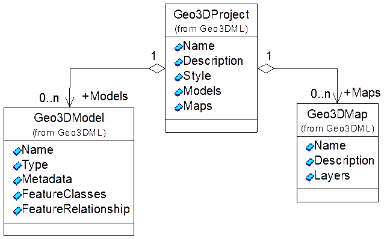
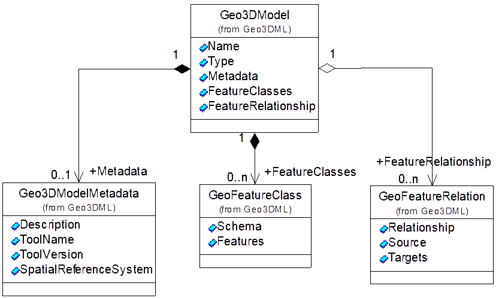
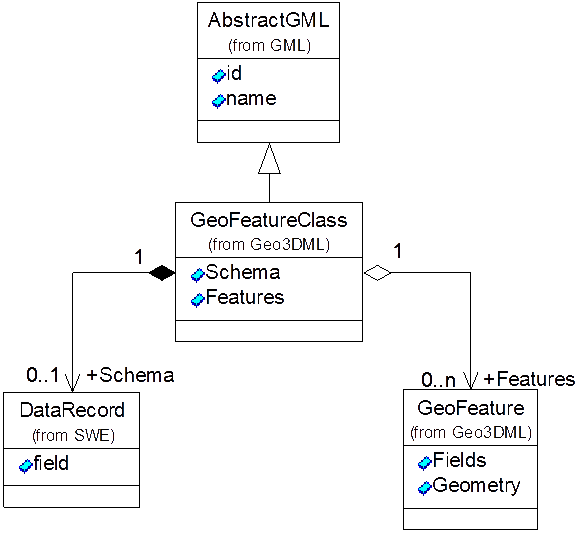
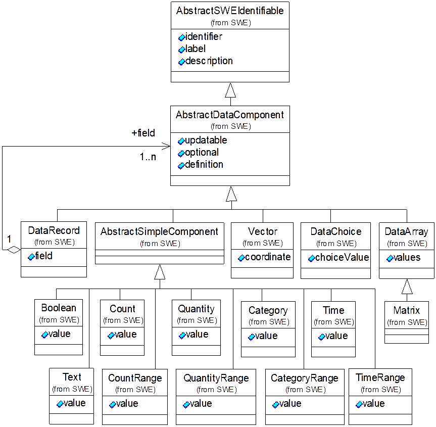
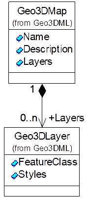
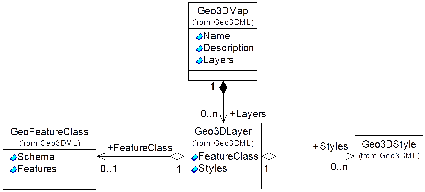

# 6 三维数据包模块

## 6.1 概述

三维数据包表示一项三维地质建模成果，是被交换的三维地质模型的完整数据，也是Geo3DML组织三维地质模型数据文件的根元素。

## 6.2 三维数据包

三维数据包在Geo3DML中用`geo3dml:Geo3DProject`来描述。对应的，在记录被交换数据的XML文件中，`geo3dml:Geo3DProject`是根元素。`geo3dml:Geo3DProject`元素的结构见[图5](#pic-5)及[表3](#tbl-3)。

<caption><a name="pic-5">图5 geo3dml:Geo3DProject的结构</a></caption>

<caption><a name="tbl-3">表3 geo3dml:Geo3DProject子元素列表（省略名字空间）</a></caption>

|序号|子集/实体名|元素名|定义|出现次数|类型|值域|
|---|---|---|---|---|---|---|
|1|Geo3DProject|Geo3DProject|三维数据包。||类||
|1.1||Name|三维数据包的名字。|1|字符串|自由文本。|
|1.2||Description|三维数据包的说明信息。|0..1|字符串|自由文本。|
|1.3||Style|全局可视化参数，包括场景的背景、全局光照等。|0..1|类|GeoSceneStyle实例（见“10.9 场景参数”）。|
|1.4|Models|Models|三维数据包中包含的Geo3DModel子元素的集合。|0..1|||
|1.4.1||Model|三维数据包中包含的Geo3DModel子元素。|0..N|类|Geo3DModel实例（见“6.3 三维地质模型”）。|
|1.5|Maps|Maps|三维数据包中包含的Geo3DMap子元素的集合。|0..1|||
|1.5.1||Map|三维数据包中包含的Geo3DMap子元素。|0..N|类|Geo3DMap实例（见“6.5 三维地质图”）。|

## 6.3 三维地质模型

三维地质模型描述地质要素及地质要素之间的关系。在Geo3DML中用`geo3dml:Geo3DModel`元素表示，由地质模型元数据、地质要素类和地质要素关系构成。该元素的结构见[图6](#pic-6)及[表4](#tbl-4)。

<caption><a name="pic-6">图6 geo3dml:Geo3DModel的结构</a></caption>

<caption><a name="tbl-4">表4 geo3dml:Geo3DModel子元素列表（省略名字空间）</a></caption>

|序号|子集/实体名|元素名|定义|出现次数|类型|值域|
|---|---|---|---|---|---|---|
|2|Geo3DModel|Geo3DModel|地质模型。||类||
|2.1||ID|地质模型元素的属性：ID。|1|字符串|自由文本。通过ID支持多文件模型数据的关联。|
|2.2||LOD|地质模型元素的属性：模型空间数据的缺省LOD级别。|1|非负整数|0表示分辨率最高的细节层次，级别增加表示分辨率降低。缺省值为0。|
|2.3||Name|地质模型的名字。|1|字符串|自由文本|
|2.4||Type|地质模型的类型。|1|字符串|枚举值：Drill（钻孔），Section（剖面），3DModel（三维地质模型），Isogram（等值图），Other（其它）。|
|2.5||Version|模型的版本信息。|1|类|如“1.2.1”。模型的版本信息是模型中空间数据和非空间数据的缺省版本信息。|
|2.5.1||Timestamp|模型版本信息元素的属性：版本对应的创建时间。|1|日期|日期与时间，如“2018-04-17T14:04:33”。|
|2.6||Metadata|地质模型元数据。|0..1|类|Geo3DModelMetadata实例（见“11 元数据模块”）。|
|2.7|FeatureClasses|FeatureClasses|地质模型中包含的地质要素类的集合。|0..1|||
|2.7.1||FeatureClass|地质模型中包含的GeoFeatureClass子元素。|0..N|类|GeoFeatureClass实例（见“6.4 地质要素类”）。|
|2.8|FeatureRelationship|FeatureRelationship|地质要素间关系的集合。|0..1|||
|2.8.1||Relation|地质要素间的关系实例。|0..N|类|GeoFeatureRelation及其子类型的实例（见“7.2 地质要素之间的关系”）。|

## 6.4 地质要素类

地质要素类元素（`geo3dml:GeoFeatureClass`）是三维地质模型元素（`geo3dml:GeoModel`）的构成部分。地质要素类是地质要素（`geo3dml:GeoFeature`）的集合，并且要求集合中的地质要素具有相同的属性结构。地质要素类元素的子元素`geo3dml:Schema`定义了该集合中地质要素的属性结构。`geo3dml:GeoFeatureClass`元素的结构见[图7](#pic-7)及[表5](#tbl-5)。

<caption><a name="pic-7">图7 geo3dml:GeoFeatureClass的结构</a></caption>

<caption><a name="tbl-5">表5 geo3dml:GeoFeatureClass子元素列表（省略名字空间）</a></caption>

|序号|子集/实体名|元素名|定义|出现次数|类型|值域|
|---|---|---|---|---|---|---|
|3|GeoFeatureClass|GeoFeatureClass|地质要素类。||类||
|3.1||Schema|地质要素类中地质要素的属性结构定义。|0..1|类|swe:DateRecord实例|
|3.2|Features|Features|地质要素类中包含的地质要素的集合。|0..1|||
|3.2.1||Feature|地质要素类中包含的地质要素实例。|0..N|类|GeoFeature实例（见“7.1 地质要素”）|

`geo3dml:GeoFeatureClass`继承自`gml:AbstractGML`，因而需要设置其实例的属性`gml:id`以作为其唯一标识符。

同一地质要素类中的地质要素必须属于同一类型，即它们具有相同的属性结构。要素类中的`geo3dml:Schema`子元素用于定义地质要素的属性结构。`geo3dml:Schema`的取值是定义于OGC SWE规范中的`swe:DataRecord`元素实例（其结构如[图8](#pic-8)所示）。在SWE规范中，`swe:DataRecord`既可用作数据描述工具也可用作数据容器。此处，该对象起数据描述工具的作用。`swe:DataRecord`对象可包含多个`swe:AbstractDataComponent`元素（作为其`swe:field`子元素的取值）；每个`swe:AbstractDataComponent`元素可用于定义一个属性字段。`swe:AbstractDataComponent`元素的类型为`swe:AbstractDataComponentType`，而该类型则派生自`swe:AbstractSWEIdentifiableType`。定义属性字段时，通过`swe:DataRecord`的子元素`swe:field`的属性`name`设置属性字段名（必填）；通过`swe:AbstractSWEIdentifiableType:label`元素设置属性字段的显示名（可选）；通过`swe:AbstractSWEIdentifiableType:description`可以设置字段的说明信息，如解释该字段的含义（可选）；通过`swe:AbstractDataComponentType:definition`可以配置字段所对应的语义信息（可选），如字段所对应的本体概念。

<caption><a name="pic-8">图8 swe:DataRecord的结构及数据类型定义</a></caption>

SWE规范定义的`swe:AbstractDataComponent`数据类型包括（见[图8](#pic-8)）：数值类型（`swe:Count`，`swe:CountRange`，`swe:Quantity`，`swe:QuantityRange`）、文本类型（`swe:Text`）、布尔类型（`swe:Boolean`）、日期与时间（`swe:Time`，`swe:TimeRange`）、离散分类值类型（`swe:Category`，`swe:CategoryRange`），以及复杂类型：向量（`swe:Vector`）、选择（`swe:DataChoice`）、数组（`swe:DataArray`）、矩阵（`swe:Matrix`）。

## 6.5 三维地质图

三维地质图是三维地质模型的可视化表达形式，在Geo3DML中用`geo3dml:Geo3DMap`表示。其结构见[图9](#pic-9)及[表6](#tbl-6)。

<caption><a name="pic-9">图9 geo3dml:Geo3DMap的结构</a></caption>

<caption><a name="tbl-6">表6 geo3dml:Geo3DMap子元素列表（省略名字空间）</a></caption>

|序号|子集/实体名|元素名|定义|出现次数|类型|值域|
|---|---|---|---|---|---|---|
|4|Geo3DMap|Geo3DMap|三维地质图。||类||
|4.1||Name|三维地质图的名字。|1|字符串|自由文本|
|4.2||Description|三维地质图的说明。|1|字符串|自由文本|
|4.3|Layers|Layers|三维地质图中包含的三维图层的集合。|0..1|||
|4.3.1||Layer|三维地质图中包含的三维图层实例。|0..N|类|Geo3DLayer实例（见“6.6 三维地质图层”）|

## 6.6 三维地质图层

三维地质图层是地质要素类中地质要素的三维可视化描述，在Geo3DML中用`geo3dml:Geo3DLayer`来表示。其结构见[图10](#pic-10)及[表7](#tbl-7)。

<caption><a name="pic-10">图10 geo3dml:Geo3DLayer的结构</a></caption>

<canvas><a name="tbl-7">表7 geo3dml:Geo3DLayer子元素列表（省略名字空间）</a></canvas>

|序号|子集/实体名|元素名|定义|出现次数|类型|值域|
|---|---|---|---|---|---|---|
|5|Geo3DLayer|Geo3DLayer|三维图层。||类||
|5.1||FeatureClass|三维图层所关联的地质要素类。|0..1|类|GeoFeatureClass实例（见“6.4 地质要素类”）|
|5.2|Styles|Styles|三维图层所关联的可视化参数的集合。|0..1|||
|5.2.1||Style|三维图层所关联的可视化参数实例。|0..N|类|Geo3DStyle实例（见“10 可视化参数模块”）|

`geo3dml:Geo3DLayer`继承自`gml:AbstractGML`，因而需要设置其实例的属性`gml:id`以作为其唯一标识符。同时，从`gml:AbstractGML`继承而来的`gml:name`子元素则用于记录三维图层的名字。
