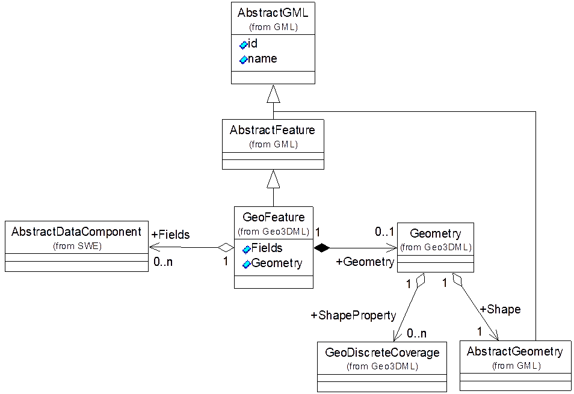
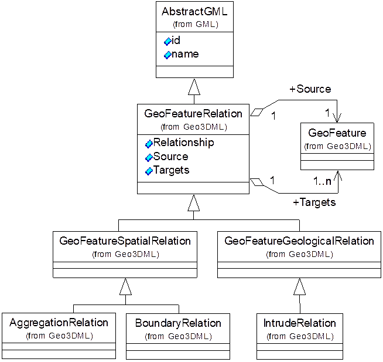

# 7 地质要素模块

## 7.1 地质要素

地质要素的属性包括几何数据属性和非几何数据属性。对于非几何数据属性，Geo3DML支持SWE规范定义的`swe:AbstractDataComponent`数据类型，包括：数值类型（`swe:Count`，`swe:CountRange`，`swe:Quantity`，`swe:QuantityRange`）、文本类型（`swe:Text`）、布尔类型（`swe:Boolean`）、日期时间（`swe:Time`，`swe:TimeRange`）、离散分类值类型（`swe:Category`，`swe:CategoryRange`），以及复杂类型：向量（`swe:Vector`）、选择（`swe:DataChoice`）、数组（`swe:DataArray`）、矩阵（`swe:Matrix`）。涉及地质术语的非几何数据属性值应遵循GB/T 9649等相关标准。对于几何数据属性，Geo3DML支持GML规范定义的几何数据结构（仅指非拓扑几何数据）和空间覆盖（Coverage）数据结构，同时对其进行扩展定义了包括TIN等在内的扩展空间数据结构（见“8 几何数据模块”）。

地质要素（`geo3dml:GeoFeature`）的结构见[图11](#pic-11)及[表8](#tbl-8)。地质要素的非几何数据属性结构的定义源自其所属的地质要素类（`geo3dml:GeoFeatureClass`）（见`geo3dml:GeoFeatureClass:Schema`，“6.4 地质要素类”）。

<caption><a name="pic-11">图11 geo3dml:GeoFeature的结构</a></caption>

<canvas><a name="tbl-8">表8 geo3dml:GeoFeature子元素列表（省略名字空间）</a></canvas>

|序号|子集/实体名|元素名|定义|出现次数|类型|值域|
|---|---|---|---|---|---|---|
|6|GeoFeature|GeoFeature|地质要素。||类||
|6.1|Fields|Fields|地质要素的非几何属性值集合。|0..1|||
|6.1.1||Field|地质要素的非几何属性值实例。|0..N|类|swe:AbstractDataComponent实例。|
|6.1.1.1||Name|地质要素的非几何属性值元素的属性。|字符串|自由文本。对应于地质要素类中定义的地质要素非几何属性字段的名字。|
|6.2|Geometry|Geometry|地质要素的几何属性数据。|0..1|||
|6.2.1||Shape|地质要素的几何属性数据。|1|类|gml:AbstractGeometry实例|
|6.2.2||ShapeProperty|与Shape元素中指定的几何对象相关的属性场数据。|0..N|类|GeoDiscreteCoverage实例（见“9 属性场数据模块”）。|

## 7.2 地质要素之间的关系

Geo3DML定义了`geo3dml:GeoFeatureRelation`来描述地质要素（`geo3dml:GeoFeature`）之间的关系，其结构见[图12](#pic-12)及[表9](#tbl-9)。`geo3dml:GeoFeatureRelation`记录的地质关系是从源要素出发到目标要素之间的关系，如岩体对地层的侵入关系，地质现象形成年代的对比关系等。

<caption><a name="pic-12">图12 geo3dml:GeoFeatureRelation的结构</a></caption>

<canvas><a name="tbl-9">表9 geo3dml:GeoFeatureRelation子元素列表（省略名字空间）</a></canvas>

|序号|子集/实体名|元素名|定义|出现次数|类型|值域|
|---|---|---|---|---|---|---|
|7|GeoFeatureRelation|GeoFeatureRelation|地质要素之间的关系。||类||
|7.1||Relationship|该关系的名字或描述。|0..1|字符串|关于地质现象的术语。|
|7.2|Source|Source|该关系中的源地质要素及其角色。|1|||
|7.2.1||Role|源地质要素在该关系中的角色。|0..1|字符串|关于地质现象的术语。|
|7.2.2||Feature|源地质要素。|1|类|引用GeoFeature实例（见“7.1 地质要素”）。|
|7.3|Targets|Targets|该关系所关联的目标地质要素及其角色。|1|||
|7.3.1||Role|目标地质要素在该关系中的角色。|0..1|字符串|关于地质现象的术语。|
|7.3.2||Feature|目标地质要素。|1..N|类|引用GeoFeature实例（见“7.1 地质要素”）。|

`geo3dml:GeologicHistory`专门描述地质要素之间关于各自所属地质年代的对比关系。针对该关系，关系的名称或描述（即`Relationship`元素的值）限定于“早于”、“晚于”，或“同期于”，分别表示源地质要素的形成年代早于、晚于或同期于目标地质要素。因为意义明确，使用该关系时，可以省略其`Source:Role`以及`Targets:Role`子元素。

`geo3dml:DefiningStructure`专门描述地质要素组合起来构成某种地质构造的关系。如上覆地层与下伏地层组合起来形成不整合构造，其中关系的名称是“不整合”，源地质要素的角色是“上覆地层”（或“下伏地层”），目标地质要素的角色是“下伏地层”（或“上覆地层”）。又如侵入体与围岩形成侵入关系，其中关系的名称是“侵入”，源地质要素的角色是“侵入体”，目标地质要素的角色是“围岩”。描述关系名称、地质要素的角色时所使用的术语应遵循GB/T 9649的规定。

`geo3dml:AggregationRelation`专门描述地质要素由一个或多个其它地质要素聚合而成的关系。如某个断层面由多个小断面聚合而成，其中源表示被组成的地质要素，目标则是组成的部分。该关系可用于描述地质要素之间的普通聚合关系，不一定具有明确的地质含义。因为意义明确，使用该关系时，可以省略其`Source:Role`以及`Targets:Role`子元素。

`geo3dml:BoundaryRelation`专门描述地质要素由作为其边界的其它地质要素包围而成的关系。该关系的源是边界所围成的地质要素，目标地质要素则是边界。该关系也不一定具有明确的地质含义。因为意义明确，使用该关系时，可以省略其`Source:Role`以及`Targets:Role`子元素。
