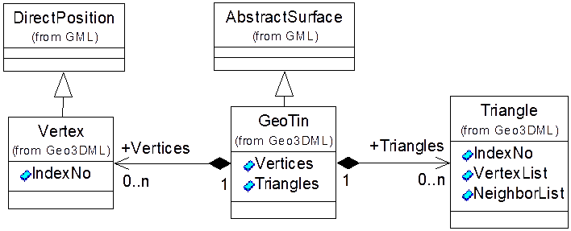
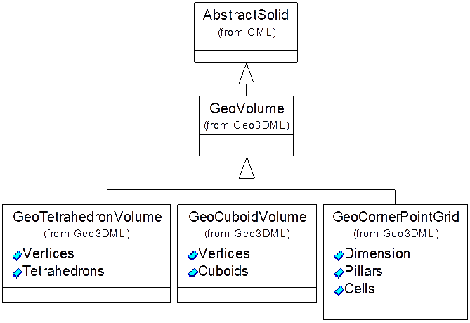
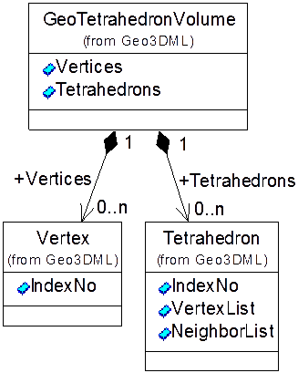
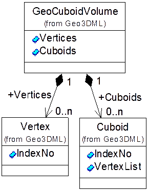
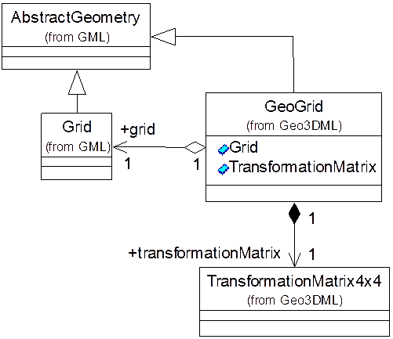

# 8 几何数据模块

## 8.1 概述

Geo3DML支持GML规范所定义的`gml:AbstractGeometry`，以及`gmlcov:AbstractCoverage`等几何数据结构。GML定义了通用的点（`gml:Point`）、线（`gml:LineString`）、面（`gml:Surface`），体（`gml:Solid`）等数据结构。Geo3DML针对其中的不规则三角网、体（专指由四面体体元或规则六面体体元构成的体以及角点网格）以及可变换格网等三种几何数据定义了专门的数据结构，分别为：`geo3dml:GeoTin`，`geo3dml:GeoVolume`（派生为`geo3dml:GeoTetrahedronVolume`、`geo3dml:GeoCuboidVolume`和`geo3dml:GeoCornerPointGrid`）及`geo3dml:GeoGrid`。这三种结构都是对`gml:AbstractGeometry`或其子类型的扩展（见[图13](#pic-13)）。

<a name="pic-13" /><caption>图13 Geo3DML扩展GML几何数据结构</caption>


## 8.2 不规则三角网

Geo3DML对`gml:AbstractSurface`进行扩展定义了不规则三角网(`geo3dml:GeoTin`)数据结构，其结构见[图14](#pic-14)及[表10](#tbl-10)。

<a name="pic-14" /><caption>图14 geo3dml:GeoTin的结构</caption>



<a name="tbl-10" /><caption>表10 geo3dml:GeoTin子元素列表（省略名字空间）</caption>

|序号|子集/实体名|元素名|定义|出现次数|类型|值域|
|---|---|---|---|---|---|---|
|8|GeoTin|GeoTin|不规则三角网。||类||
|8.1|Vertices|Vertices|三角网的顶点列表。|0..1|||
|8.1.1||Vertex|三角网的顶点实例。|0..N|类|Vertex实例|
|8.1.1.1||IndexNo|顶点元素的属性：索引号。该索引号在当前顶点列表内是唯一的，以标识该顶点。|1|非负整数|非负整数，并且在当前顶点列表内取值唯一。|
|8.2|Triangles|Triangles|三角网的三角形列表。|0..1|||
|8.2.1||Triangle|三角网中的三角形实例。|0..N|类|Triangle实例|
|8.2.1.1||IndexNo|三角形元素的属性：索引号。该索引号在当前三角形列表内是唯一的，以标识该三角形。|1|非负整数|非负整数，并且在当前三角形列表内取值唯一。|
|8.2.1.2||VertexList|三角形的顶点列表。|1|类|长度为3的gml:integerList实例。该列表引用三角网顶点表中顶点的索引号，以标记三角形的三个顶点。|
|8.2.1.3||NeighborList|三角形的邻接三角形列表。|0..1|类|长度为3的gml:integerList实例。该列表引用三角网内三角形表中三角形的索引号，以标记三角形的邻接三角形。|

`geo3dml:GeoTin`由顶点表（`Vertices`子元素）及三角形表（`Triangles`子元素）两部分构成。顶点表记录构成TIN的所有顶点（`Vertex`）。`Vertex`继承自`gml:DirectPosition`，从而可以直接记录顶点的坐标。同时，`Vertex`的属性——`IndexNo`——用于标记该顶点的索引号。该索引号在当前顶点表中必须是唯一的，以允许在三角形表中通过顶点索引号标识构成三角形的顶点。

`geo3dml:GeoTin`的三角形表描述组成TIN的所有三角形（`Triangle`），三角形则由顶点列表（`VertexList`）和邻接三角形列表（`NeighborList`）两部分组成。同时，每个三角形也有索引号（通过属性`IndexNo`记录）。该索引号是非负整数，并且在当前三角形表中是唯一的。三角形的`VertexList`是包含3个非负整数的列表。列表中的元素是组成该三角形的3个顶点的索引号。三角形的`NeighborList`也是包含3个整数的列表。列表中的元素则是该三角形的3个邻接三角形的索引号，并且约定使用值`-1`表示对应的邻接三角形不存在。假设某三角形T的`VertexList`取值为`(V1，V2，V3)`，`NeighborList`取值为`(T1，T2，T3)`，则三角形T1是与三角形T共用顶点V1所对的边的三角形（见[图15](#pic-15)），其它类推。[图15](#pic-15)中T3取值为-1，表示对应的邻接三角形不存在。

<a name="pic-15" /><caption>图15 三角形顶点与邻接三角形的对应关系示意图</caption>


## 8.3 体元构成的体

### 8.3.1 体

Geo3DML对`gml:AbstractSolid`进行扩展定义了由相同类型体元填充而成的三维体数据结构（`geo3dml:GeoVolume`）。当前版本中支持体元为四面体（Tetrahedron）或规则六面体（Cuboid）两种类型的体，以及角点网格描述的体。`geo3dml:GeoVolume`的结构见[图16](#pic-16)。

<a name="pic-16" /><caption>图16 geo3dml:GeoVolume的结构</caption>



<a name="tbl-11" /><caption>表11 geo3dml:GeoVolume子元素列表（省略名字空间）</caption>

|序号|子集/实体名|元素名|定义|出现次数|类型|值域|
|---|---|---|---|---|---|---|
|9|GeoVolume|GeoVolume|体。||类||

### 8.3.2 四面体体元构成的体 

`geo3dml:GeoTetrahedronVolume`表达四面体体元构成的体，其结构见[图17](#pic-17)及[表12](#tbl-12)。

<a name="pic-17" /><caption>图17 geo3dml:GeoTetrahedronVolume的结构</caption>



<a name="tbl-12" /><caption>表12 geo3dml:GeoTetrahedronVolume子元素列表（省略名字空间）</caption>

|序号|子集/实体名|元素名|定义|出现次数|类型|值域|
|---|---|---|---|---|---|---|
|10|GeoTetrahedronVolume|GeoTetrahedronVolume|四面体体元构成的体。||类||
|10.1|Vertices|Vertices|顶点列表。|0..1|||
|10.1.1||Vertex|顶点实例。|0..N|类|Vertex实例|
|10.1.1.1||IndexNo|顶点元素的属性：索引号。该索引号在当前顶点列表内是唯一的，以标识该顶点。|非负整数|非负整数，并且在当前顶点列表内取值唯一。|
|10.2|Tetrahedrons|Tetrahedrons|四面体体元列表。|0..1|||
|10.2.1||Tetrahedron|四面体体元实例。|0..N|类|Tetrahedron实例|
|10.2.1.1||IndexNo|四面体体元实例的属性：索引号。该索引号在当前体元列表内是唯一的，以标识该体元。|1|非负整数|非负整数，并且在当前体元列表内取值唯一。|
|10.2.1.2||VertexList|四面体的顶点列表。|1|类|长度为4的gml:integerList实例。该列表引用顶点列表中顶点的索引号，以标记四面体的四个顶点。|
|10.2.1.3||NeighborList|四面体的邻接四面体列表。|0..1|类|长度为4的gml:integerList实例。该列表引用体元表中四面体体元的索引号，以标记四面体的邻接体元。|

`geo3dml:GeoTetrahedronVolume`是`geo3dml:GeoVolume`的派生类型，表示体元为四面体的体。其由顶点表（`Vertices`成员）及体元表（`Tetrahedrons`成员）两部分构成。顶点表记录构成该体的所有顶点（`Vertex`）。`Vertex`继承自`gml:DirectPosition`，从而可以直接记录顶点的坐标。同时，`Vertex`的属性——`IndexNo`——用于标记该顶点的索引号。该索引号在当前顶点表中必须是唯一的，以允许在体元表中通过顶点索引号标识构成体元的顶点。体元表记录四面体体元列表。对于四面体体元，`IndexNo`记录其在体元列表中的索引号；`VertexList`是包含4个非负整数的列表，列表中的元素是构成该四面体的4个顶点的索引号；`NeighborList`是包含4个整数的列表，列表中的元素是其4个邻接四面体体元的索引号，并且约定使用值`-1`表示对应的邻接体元不存在。假设四面体体元T的`VertexList`取值为`(V1，V2，V3，V4)`，`NeighborList`取值为`(T1，T2，T3，T4)`，则四面体T1是与四面体T共用顶点V1所对的三角形的四面体。

### 8.3.3 规则六面体体元构成的体

`geo3dml:GeoCuboidVolume`表达规则六面体体元构成的体，其结构见[图18](#pic-18)及[表13](#tbl-13)。

<a name="pic-18" /><caption>图18 geo3dml:GeoCuboidVolume的结构</caption>



<a name="tbl-13" /><caption>表13 geo3dml:GeoCuboidVolume子元素列表（省略名字空间）</caption>

|序号|子集/实体名|元素名|定义|出现次数|类型|值域|
|---|---|---|---|---|---|---|
|11|GeoCuboidVolume|GeoCuboidVolume|规则六面体体元构成的体。||类||
|11.1|Vertices|Vertices|顶点列表。|0..1|||
|11.1.1||Vertex|顶点实例。|0..N|类|Vertex实例。|
|11.1.1.1||IndexNo|顶点元素的属性：索引号。该索引号在当前顶点列表内是唯一的，以标识该顶点。|非负整数|非负整数，并且在当前顶点列表内取值唯一。|
|11.2|Cuboids|Cuboids|规则六面体体元列表。|0..1|||
|11.2.1||Cuboid|规则六面体体元实例。|0..N|类|Cuboid实例。|
|11.2.1.1||IndexNo|规则六面体体元实例的属性：索引号。该索引号在当前体元列表内是唯一的，以标识该体元。|1|非负整数|非负整数，并且在当前体元列表内取值唯一。|
|11.2.1.2||VertexList|规则六面体的顶点列表。|1|类|长度为8的gml:integerList实例。该列表引用顶点列表中顶点的索引号，以标记规则六面体的八个顶点。|

`geo3dml:GeoCuboidVolume`是`geo3dml:GeoVolume`的派生类型，表示体元为规则六面体的体。其由顶点表（`Vertices`成员）及体元表（`Cuboids`成员）两部分构成。顶点表记录构成该体的所有顶点（`Vertex`）。`Vertex`继承自`gml:DirectPosition`，从而可以直接记录顶点的坐标。同时，`Vertex`的属性——`IndexNo`——用于标记该顶点的索引号。该索引号在当前顶点表中必须是唯一的，以允许在体元表中通过顶点索引号标识构成体元的顶点。体元表记录规则六面体体元列表。对于规则六面体体元，`IndexNo`记录其在体元列表中的索引号；`VertexList`是包含8个正整数的列表，列表中的元素是构成该规则六面体的8个顶点的索引号。要求先按序保存某个侧面4个顶点的索引号，然后按同样的顺序保存与该侧面平行的另一侧面的4个顶点的索引号。不需指定规则六面体的邻接体元。

### 8.3.4 角点网格

`geo3dml:GeoCornerPointGrid`表达角点网格，其结构见[图16](#pic-16)及[表14](#tbl-14)。

<a name="tbl-14" /><caption>表14 geo3dml:GeoCornerPointGrid子元素列表（省略名字空间）</caption>

|序号|子集/实体名|元素名|定义|出现次数|类型|值域|
|---|---|---|---|---|---|---|
|12|GeoCornerPointGrid|GeoCornerPointGrid|角点网格。||类||
|12.1|Dimension|Dimension|角点网格的维度，即其沿I、J、K轴方向各自划分体元的数目。|1||长度为3的gml:integerList实例，记录角点网格沿I、J、K轴划分体元的数目。|
|12.2|Pillars|Pillars|角点网格的Pillar线组成的数组。|0..1|||
|12.2.1||Pillar|角点网格的Pillar线，即沿K轴延展的直线段。|0..N|类||
|12.2.1.1||HeadPos|Pillar线的首顶点。|1|类|gml:DirectPosition实例。|
|12.2.1.2||TailPos|Pillar线的尾顶点。|1|类|gml:DirectPosition实例。|
|12.3|Cells|Cells|角点网格的体元组成的数组。|0..1|||
|12.3.1||ZValue|标记子元素Cell中记录的值的类型。|1|字符串|elevation表示海拔高程值（Z坐标）；length表示与Pillar线首顶点的距离。|
|12.3.2||Cell|角点网格的六面体体元。|0..N|长度为8的gml:doubleList实例，记录体元8个顶点的Z值或与Pillar首顶点的距离。|
|12.3.2.1||Valid|标记本体元是否有效。|1|布尔|缺省值为true。|

`geo3dml:GeoCornerPointGrid`是`geo3dml:GeoVolume`的派生类型，表示角点网格。其由`Dimension`、`Pillars`及`Cells`三部分构成。

子元素`Dimension`记录网格沿I、J、K三轴方向各自划分体元的数目。

子元素`Pillars`记录网格的`Pillar`线集合。`Pillar`线是沿K轴延展的直线段，表达的是体元的边界。设该角点网格的维度为(N<sub>i</sub>, N<sub>j</sub>, N<sub>k</sub>)，并以I方向为“行”、以J方向为“列”，则网格的Pillar线可记为(N<sub>j</sub> + 1) 行、(N<sub>i</sub> + 1) 列，总条数为 (N<sub>j</sub> + 1) * (N<sub>i</sub> + 1)。本元素以“行”优先的方式记录所有的Pillar线，即先记录第0行包含的第0列至第N<sub>i</sub>列的共(N<sub>i</sub> + 1)条Pillar线，然后记录第1行包含的第0列至第N<sub>i</sub>列的共(N<sub>i</sub> + 1)条Pillar线，……，最后记录第N<sub>j</sub>行包含的第0列至第N<sub>i</sub>列的共(N<sub>i</sub> + 1)条Pillar线。每条Pillar线由其首尾顶点的坐标确定，即分别对应`HeadPos`和`TailPos`子元素。

子元素`Cells`记录角点网格的体元集合。设角点网格的维度为(N<sub>i</sub>, N<sub>j</sub>, N<sub>k</sub>)，则其所包含的体元总数为(N<sub>i</sub> * N<sub>j</sub> * N<sub>k</sub>)。以I方向为“行”、J方向为“列”、K方向为“层”，本元素按行-列-层优先的顺序顺次记录体元的位置。即先记录索引值为(x, 0, 0)（其中x为整数，且x∈[0,N<sub>i</sub>)）的体元，接着记录索引值为(x, 1, 0)的体元，……，接着记录索引值为(x, 0, 1)的体元，……最后记录索引值为(x, N<sub>j</sub> - 1,  N<sub>k</sub> - 1)的体元。角点网格中的体元是六面体，由其顶面4个顶点及底面4个顶点（称为“角点”）来确定。而这些角点均位于Pillar线上，因此仅需记录各角点的Z坐标值或其在对应Pillar线上距离Pillar线首顶点的距离即可确定角点的位置。若在坐标系I-J-K内平移该体元，使其一顶点与原点重合，并使得过该顶点的三条棱分别与对应的坐标轴的正方向重合，然后分别以该三条棱的长度为单位长度，则可以记该体元8个角点的坐标为(0,0,0)、(1,0,0)、(0,1,0)、(1,1,0)、(0,0,1)、(1,0,1)、(0,1,1)、(1,1,1)。子元素`Cell`按此顺序记录各角点的Z坐标值或其与Pillar线首顶点的距离。若记体元的索引值为(i,j,k)，则上述8个角点各自所对应的Pillar线的索引值分别为：(i, j)、(i + 1, j)、(i, j + 1)、(i + 1, j + 1)、(i,j)、(i + 1, j)、(i, j + 1)、(i + 1, j + 1)。

## 8.4 可变换格网

规则格网隐式地表达了网格之间的空间结构。如GML中`gml:Grid`定义了网格起点、采样间距和偏移向量信息等，隐式地描述了网格的空间结构。为了表达地质建模工作中常用的变换格网，Geo3DML定义了`geo3dml:GeoGrid`结构。该数据结构是在`gml:Grid`的基础上增加了坐标变换矩阵，其结构见[图19](#pic-19)及[表15](#tbl-15)。

<a name="pic-19" /><caption>图19 geo3dml:GeoGrid的结构</caption>



<a name="tbl-15" /><caption>表15 geo3dml:GeoGrid子元素列表（省略名字空间）</caption>

|序号|子集/实体名|元素名|定义|出现次数|类型|值域|
|---|---|---|---|---|---|---|
|13|GeoGrid|GeoGrid|变换格网。||类||
|13.1||Grid|格网数据。|1|类|gml:Grid实例|
|13.2||TransformationMatrix|格网的坐标变换矩阵。|0..1|类|geo3dml:TransformationMatrix4x4实例（见“12 基础数据结构模块”）|

## 8.5 几何数据的二进制格式

### 8.5.1 在XML文档中嵌入二进制数据流

OGC定义了空间数据的二进制数据格式：WKB (Well Known Binary)。Geo3DML支持在XML文档中采用WKB规范存储几何数据：要求先按WKB规范生成几何数据的二进制数据流，之后使用Base64编码方式将二进制流转换为字符串，并将该字符串作为几何数据存储在XML文档中；同时在相应几何对象的起始XML标签中通过属性`dt:dt="base64Binary`注明其数据为二进制格式。下面的示例给出了分别用文本格式以及二进制格式表示的`gml:LineString`对象。

> ```xml
> <!—文本格式表示的gml:LineString对象。 -->
> <gml:LineString gml:id="s1-LineString-21">
> <gml:posList srsDimension="3" count="2">
> 0 85.6205 10
> 0 63.6334 27.9083
> </gml:posList>
> </gml:LineString>
> 
> <!—二进制格式表示的gml:LineString对象（二进制数据流按Base64方式编码）。 -->
> <gml:LineString gml:id="s1-LineString-21" dt:dt=”base64Binary”>
> UEsDBBQAAAAIAGtaMS2/u6RnIAAAAIYAAAAKAAAAYm
> </gml:LineString>
> ```

Geo3DML中Base64编码算法采用的代码表字符包括：[A-Z]，[a-z]，[0-9]，+，/，=。本标准所采用的Base64编码/解码算法的参考实现见“附录C：Base64编码/解码参考实现”。

### 8.5.2 扩展的几何数据的WKB格式

Geo3DML扩展了GML规范定义的几何数据结构。扩展的结构包括不规则三角网（`geo3dml: GeoTin`）（见“8.2 不规则三角网”）、体（`geo3dml:GeoVolume`）（见“8.3 体元构成的体”）以及可变换格网（`geo3dml:GeoGrid`）（见“8.4 可变换格网”）。按OGC WKB规范的形式，本小节定义关于`geo3dml:GeoTin`及`geo3dml:GeoVolume`的二进制格式。因为`geo3dml:GeoVolume`是抽象类型，所以本小节实际是定义了其具体的派生类型的二进制格式。对于`geo3dml:GeoGrid`，因其结构复杂，不可简单地定义其二进制格式，而仍旧采用文本格式记录数据。

+ （1）扩展结构的类型代码

OGC WKB为已知的几何数据结构定义了类型代码（`WKBGeometryType`），以便于解析二进制数据流时识别原始对象的类型。在其基础上，Geo3DML为`geo3dml:GeoTin`、`geo3dml:GeoVolume`的具体类型定义的类型代码分别为（见[表16](#tbl-16)）。

<a name="tbl-16" /> <caption>表16 扩展的几何数据类型代码</caption>

|类型|代码|
|---|---|
|geo3dml:Vertex|9101|
|geo3dml:GeoTin|9111|
|geo3dml:Triangle|9112|
|geo3dml:GeoTetrahedronVolume|9113|
|geo3dml:Tetrahedron|9114|
|geo3dml:GeoCuboidVolume|9115|
|geo3dml:Cuboid|9116|
|geo3dml:GeoCornerPointGrid|9117|
|geo3dml:GeoCornerPointGridPillar|9118|
|geo3dml:GeoCornerPointGridCell|9119|

+ （2）扩展结构的WKB格式

参照OGC WKB格式定义的关于扩展结构的二进制数据格式如下（扩展的结构全为三维几何数据）。

> ```c
> WKBVertex {
>   byte            byteOrder;
>   static uint32   wkbType=9101;
>   uint32          indexNo;        // 顶点的序号
>   PointZ          point;          // 顶点的坐标
> };
> 
> WKBTriangle {
>   byte            byteOrder;
>   static uint32   wkbType=9112;
>   uint32          indexNo;          // 三角形的序号
>   uint32          uint32[3];        // 3个顶点的序号列表
>   uint32          uint32[3];        // 3个邻接三角型的序号列表
> };
> 
> WKBGeoTin {
>   byte            byteOrder;
>   static uint32   wkbType=9111;
>   uint32          numVertices;                // 顶点的数目
>   WKBVertex       WKBVertex[numVertices];     // 顶点列表
>   uint32          numTriangles;               // 三角形的数目
>   WKBTriangle     WKBTriangle[numTriangles];  // 三角形列表
> };
> 
> WKBTetrahedron {
>   byte            byteOrder;
>   static uint32   wkbType=9114;
>   uint32          indexNo;            // 四面体的序号
>   uint32          uint32[4];          // 4个顶点的序号列表
>   uint32          uint32[4];          // 4个邻接四面体的序号列表
> };
> 
> WKBGeoTetrahedronVolume {
>   byte            byteOrder;
>   static uint32   wkbType=9113;
>   uint32          numVertices;                // 顶点的数目
>   WKBVertex       WKBVertex[numVertices];     // 顶点列表
>   Uint32          numCells;                   // 体元的数目
>   WKBTetrahedron  WKBTetrahedron[numCells];   // 四面体列表
> };
> 
> WKBCuboid {
>   byte            byteOrder;
>   static uint32   wkbType=9116;
>   uint32          ndexNo;            // 规则六面体的序号
>   uint32          uint32[8];         // 8个顶点的序号列表
> };
> 
> WKBGeoCuboidVolume {
>   byte            byteOrder;
>   static uint32   wkbType=9115;
>   uint32          numVertices;                // 顶点的数目
>   WKBVertex       WKBVertex[numVertices];     // 顶点列表
>   uint32          numCells;                   // 体元的数目
>   WKBCuboid       WKBCuboid[numCells];        // 规则六面体列表
> };
> 
> WKBGeoCornerPointGridPillar {
>   byte            byteOrder;
>   static uint32   wkbType=9118;
>   PointZ          headPos;                     // Pillar线的首顶点
>   PointZ          tailPos;                     // Pillar线的尾顶点
> };
>
> WKBGeoCornerPointGridCell {
>   byte            byteOrder;
>   static uint32   wkbType=9119;
>   bool            valid;                      // 为true时表示该体元有效，否则表示无效
>   double          double[8];                  // 体元8顶点在各自Pillar上的位置
> };
>
> WKBGeoCornerPointGrid {
>   byte               byteOrder;
>   static uint32        wkbType=9117;
>   uint32             dimI;                    // 沿I轴划分体元的个数
>   uint32             dimJ;                    // 沿J轴划分体元的个数
>   uint32             dimK;                    // 沿K轴划分体元的个数
>   // 如“8.3.4 角点网格”所述，以I方向为“行”、以J方向为“列”，则网格的Pillar线可记为(dimJ + 1) 行、(dimI + 1) 列，总条数为 (dimJ + 1) * (dimI + 1)，可记为numPillars。下面的成员按序记录每条Pillar线的位置。
>   WKBGeoCornerPointGridPillar WKBGeoCornerPointGridPillar[numPillars];
>   // 如“8.3.4 角点网格”所述，每个体元由其8个顶点的位置来描述其具体位置。网格中体元的总数为：numCells = dimI * dimJ * dimK。下面的成员按序记录每个体元的位置。
>   WKBGeoCornerPointGridCell WKBGeoCornerPointGridCell[numCells];
};
> ```
