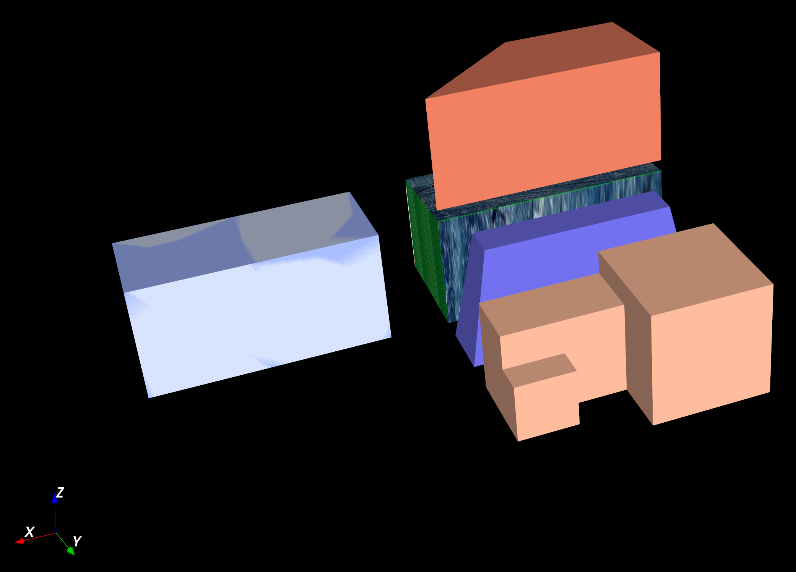

这是原Geo3DML(v1.0)标准文档“附录B：Geo3DML示例数据”的内容。

本附录给出的Geo3DML编码示例数据记录了一个名为“示例项目”的数据交换项目（文件project.xml）。该项目包含的数据包括：

+ 一个名为“钻孔_ZK0”的描述某钻孔的地质模型（文件model_drill.xml）及其对应的三维可视化结果——名为“ZK0”的三维地质图（文件map_drill.xml）；

+ 一个名为“剖面_m1”的描述某剖面的地质模型（文件model_section.xml）及其对应的三维可视化结果——名为“m1”的三维地质图（文件map_section.xml）；

+ 一个由SGrid网格填充的地质体（文件model_SGrid.xml）。

该示例数据由如下7个文件组成：

+ [project.xml](./project.xml)

+ [model_drill.xml](./model_drill.xml)

+ [model_section.xml](./model_section.xml)

+ [model_SGrid.xml](./model_SGrid.xml)

+ [map_drill.xml](./map_drill.xml)

+ [map_section.xml](./map_section.xml)

+ [map_stratum.xml](./map_stratum.xml)

该示例的展示效果如下图所示：

